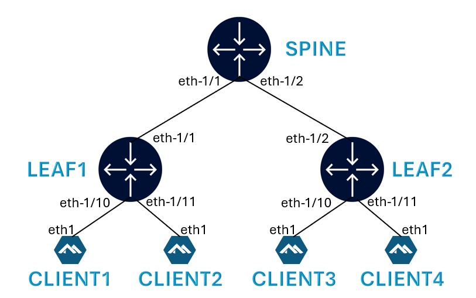
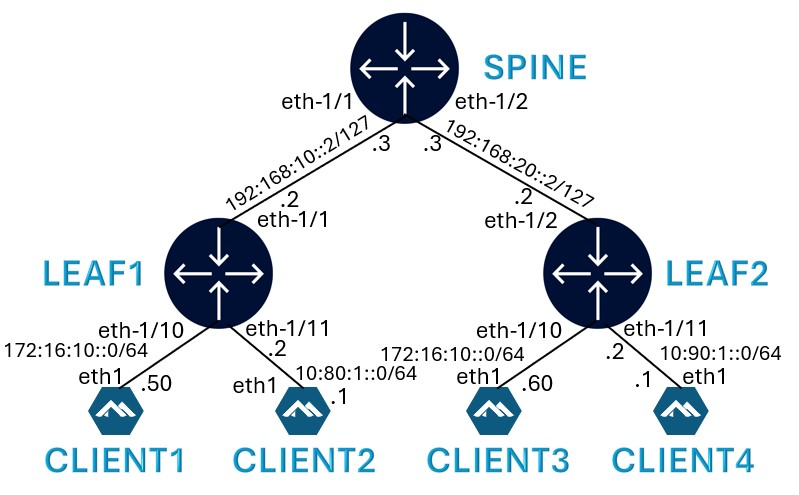
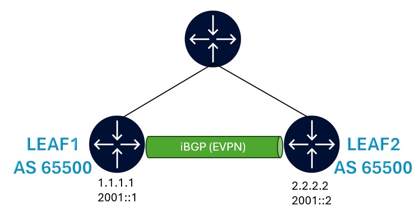
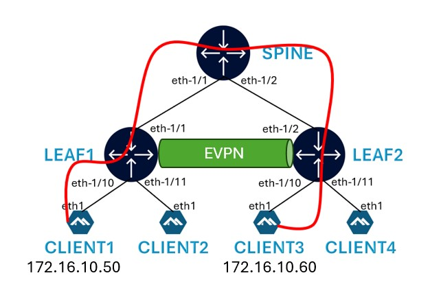
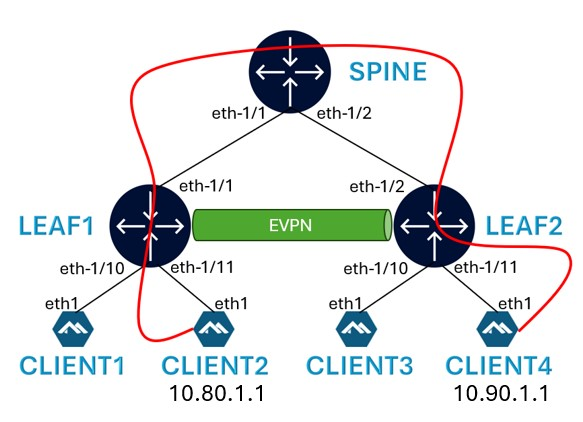

# Welcome to the Myriad 360 Nokia SRLinux Workshop


Please contact [**Mohammad Zaman**](https://www.linkedin.com/in/mohammad-zaman-61496958), [**Amit Kumar**](https://www.linkedin.com/in/spiky27) or [**Frank Cordova**](https://www.linkedin.com/in/frank-cordova-955998111/) if you have any questions.


Table of Contents

## Table of Contents

1. [Lab Topology](#lab-topology)  
2. [Tools](#tools)  
3. [Deploying the Lab](#deploying-the-lab)  
4. [SR Linux Configuration Mode](#sr-linux-configuration-mode)  
5. [Activity 1: Configure BGP Underlay](#activity-1-configure-bgp-underlay)  
6. [Activity 2: Configure BGP-EVPN for Overlay](#activity-2-configure-bgp-evpn-for-overlay)  
7. [Activity 3: Configure L2 EVPN-VxLAN](#activity-3-configure-l2-evpn-vxlan)  
8. [Activity 4: Configure L3 EVPN-VxLAN](#activity-4-configure-layer-3-evpn-vxlan)
9. [Troubleshooting Tools](#troubleshooting-tools)
10. [Explore This Lab with Pre-Configured Setup](#explore-this-lab-with-everything-pre-configured) 
11. [Useful Links](#useful-links)


## Lab Topology

Each workshop participant will be provided with the below topology consisting of 2 leaf and 1 spine nodes along with 4 clients.




## Tools 

| Node  | Role  | AS Number | IP Version Used | NOS     |
|:------|:------|:----------|:----------------|:--------|
| Leaf1 | Leaf  | 65101     | IPv4/IPv6       | SR Linux |
| Leaf2 | Leaf  | 65102     | IPv4/IPv6       | SR Linux |
| Spine | Spine | 65000     | IPv4/IPv6       | SR Linux |
| Client1/2/3/4 | Hosts |      | IPv4       | Linux/Alpine |


## Deploying the lab

**Step-1: Clone the repo**

Use the below command to clone this repo to your VM.

```bash
sudo git clone https://github.com/learn-nokia/srlinux_evpn.git
```

**Step-2: Deploy the lab**

```bash
cd srlinux_evpn/srl-evpn-lab/
sudo clab deploy -t srl-evpn.clab.yml
```

[Containerlab](https://containerlab.dev/) will deploy the lab and display a table with the list of nodes and their IPs.

```bash
❯ clab deploy -t srl-evpn.clab.yml
20:43:18 INFO Containerlab started version=0.67.0
20:43:18 INFO Parsing & checking topology file=srl-evpn.clab.yml
20:43:18 INFO Creating docker network name=srl-evpn-lab-mgmt IPv4 subnet=172.20.20.0/24 IPv6 subnet=2001:172:20:20::/64 MTU=0
20:43:18 INFO Creating lab directory path=/home/srlinux_evpn/srl-evpn-lab/clab-srl-evpn
20:43:18 INFO Creating container name=client4
20:43:18 INFO Creating container name=client2
20:43:18 INFO Creating container name=client1
20:43:18 INFO Creating container name=client3
20:43:18 INFO Creating container name=leaf1
20:43:18 INFO Creating container name=spine
20:43:18 INFO Creating container name=leaf2
20:43:19 INFO Created link: leaf1:e1-1 ▪┄┄▪ spine:e1-1
20:43:19 INFO Created link: client3:eth1 ▪┄┄▪ leaf2:e1-10
20:43:19 INFO Created link: client1:eth1 ▪┄┄▪ leaf1:e1-10
20:43:19 INFO Created link: client4:eth1 ▪┄┄▪ leaf2:e1-11
20:43:19 INFO Created link: leaf2:e1-2 ▪┄┄▪ spine:e1-2
20:43:19 INFO Running postdeploy actions kind=nokia_srlinux node=spine
20:43:19 INFO Running postdeploy actions kind=nokia_srlinux node=leaf2
20:43:19 INFO Created link: client2:eth1 ▪┄┄▪ leaf1:e1-11
20:43:19 INFO Running postdeploy actions kind=nokia_srlinux node=leaf1
20:43:42 INFO Executed command node=client1 command="ip address add 172.16.10.50/24 dev eth1" stdout=""
20:43:42 INFO Executed command node=client1 command="ip -6 address add 172:16:10::50/64 dev eth1" stdout=""
20:43:42 INFO Executed command node=client1 command="ip route add 10.90.1.0/24 via 172.16.10.254" stdout=""
20:43:42 INFO Executed command node=client1 command="ip route add 10.80.1.0/24 via 172.16.10.254" stdout=""
20:43:42 INFO Executed command node=client1 command="ip -6 route add 10:90:1::/64 via 172:16:10::254" stdout=""
20:43:42 INFO Executed command node=client1 command="ip -6 route add 10:80:1::/64 via 172:16:10::254" stdout=""
20:43:42 INFO Executed command node=client3 command=/root/restart-services.sh stdout=""
20:43:42 INFO Executed command node=client3 command="ip -6 route add 10:90:1::/64 via 172:16:10::253" stdout=""
20:43:42 INFO Executed command node=client3 command="ip -6 route add 10:80:1::/64 via 172:16:10::253" stdout=""
20:43:42 INFO Executed command node=client2 command=/root/restart-services.sh stdout=""
20:43:42 INFO Executed command node=client2 command="ip route add 172.16.10.0/24 via 10.80.1.2" stdout=""
20:43:42 INFO Executed command node=client2 command="ip -6 route add 10:90:1::/64 via 10:80:1::2" stdout=""
20:43:42 INFO Executed command node=client4 command=/root/restart-services.sh stdout=""
20:43:42 INFO Executed command node=client4 command="ip route add 172.16.10.0/24 via 10.90.1.2" stdout=""
20:43:42 INFO Executed command node=client4 command="ip -6 route add 10:80:1::/64 via 10:90:1::2" stdout=""
20:43:42 INFO Adding host entries path=/etc/hosts
20:43:42 INFO Adding SSH config for nodes path=/etc/ssh/ssh_config.d/clab-srl-evpn.conf
╭─────────┬──────────────────────────────┬─────────┬────────────────────╮
│   Name  │          Kind/Image          │  State  │   IPv4/6 Address   │
├─────────┼──────────────────────────────┼─────────┼────────────────────┤
│ client1 │ linux                        │ running │ 172.20.20.10       │
│         │ ghcr.io/srl-labs/alpine      │         │ 2001:172:20:20::10 │
├─────────┼──────────────────────────────┼─────────┼────────────────────┤
│ client2 │ linux                        │ running │ 172.20.20.11       │
│         │ ghcr.io/srl-labs/alpine      │         │ 2001:172:20:20::11 │
├─────────┼──────────────────────────────┼─────────┼────────────────────┤
│ client3 │ linux                        │ running │ 172.20.20.12       │
│         │ ghcr.io/srl-labs/alpine      │         │ 2001:172:20:20::12 │
├─────────┼──────────────────────────────┼─────────┼────────────────────┤
│ client4 │ linux                        │ running │ 172.20.20.13       │
│         │ ghcr.io/srl-labs/alpine      │         │ 2001:172:20:20::13 │
├─────────┼──────────────────────────────┼─────────┼────────────────────┤
│ leaf1   │ nokia_srlinux                │ running │ 172.20.20.2        │
│         │ ghcr.io/nokia/srlinux:25.3.1 │         │ 2001:172:20:20::2  │
├─────────┼──────────────────────────────┼─────────┼────────────────────┤
│ leaf2   │ nokia_srlinux                │ running │ 172.20.20.4        │
│         │ ghcr.io/nokia/srlinux:25.3.1 │         │ 2001:172:20:20::4  │
├─────────┼──────────────────────────────┼─────────┼────────────────────┤
│ spine   │ nokia_srlinux                │ running │ 172.20.20.3        │
│         │ ghcr.io/nokia/srlinux:25.3.1 │         │ 2001:172:20:20::3  │
╰─────────┴──────────────────────────────┴─────────┴────────────────────╯
```

To display all deployed labs on your VM at any time, use:

```bash
sudo clab inspect --all
```

### Connecting to the devices

Find the nodename or IP address of the device from the above output.

Username: `admin` </br>
Password: ********(ask instructor)

```bash
ssh admin@leaf1
```

To login to the client, identify the client hostname using the `sudo clab inspect --all` command above and then:

```bash
sudo docker exec –it client3 sh
```

### Lab Default Startup Configuration

When the lab is deployed using the default startup configuration, all links are automatically set up with both IPv4 and IPv6 addresses.

**Included in the Startup Configuration**

- **Leaf-to-Spine Interface Configuration**  
  Interfaces between Leaf and Spine nodes are configured with IP addresses.

- **Leaf-to-Client Interface Configuration**  
  Interfaces between Leaf nodes and connected Client devices are configured.

- **System Loopback Setup**  
  Each device has a system loopback interface configured.

- **Route Policy for Loopback Advertisement**  
  A route policy is created to advertise system loopbacks, which will later be applied under BGP.

- **Default Network Instance (VRF) Configuration**  
  The system loopback and Leaf-Spine interfaces are added to the default network instance (VRF).

- **Client IP and Static Route Setup**  
  Clients are configured with IP addresses and static routes for network reachability.


Check the [startup config](srl-evpn-lab/configs/fabric/startup) files to see how these objects are set up in SR Linux.

### Verification

To view Interface status on SR Linux use:

```srl
show interface
```
or

```
info interface *
```

### IPv4 Link Addressing


### IPv6 Link Addressing



### Routing Policy

```
info routing-policy
```

### Verify reachability between devices

After the lab is deployed, check reachability between leaf and spine devices using ping.

Example on spine to Leaf1 using IPv4:

```srl
ping -c 3 192.168.10.2 network-instance default
```

Example on spine to Leaf1 using IPv6:

```srl
ping6 -c 3 192:168:10::2 network-instance default
```

## SR Linux Configuration Mode

To enter candidate configuration edit mode in SR Linux, use:

```srl
enter candidate
```

To commit the configuration in SR Linux, use:

```srl
commit save
```

Here's a reference table with some commonly used commands.

| Action | Command |
| --- | --- |
| Enter Candidate mode | `enter candidate {private}` |
| Commit configuration changes | `commit {now\|stay}` |
| | `now` – commits and exits from candidate mode |
| | `stay` – commits and stays in candidate mode |
| Delete configuration elements | `delete` |
| | Eg: `delete interface ethernet-1/5` |
| Discard configuration changes | `discard {now\|stay}` |
| Compare candidate to running | `diff running /` |
| View configuration in current mode & context | `info {flat}` |
| View configuration in another mode & context | `info {flat} from state /interface ethernet-1/1` |
| Output modifiers | `<command> \| as {table\|json\|yaml}` |
| Access Linux shell | `bash` |
| Find a command | `tree flat detail \| grep <keyword>` |


## Activity-1: Configure BGP Underlay

-  BGP is widely used for building Data Center Fabric networks, though alternatives like OSPF and IS-IS are also common.

-  In this lab, each Leaf node is placed in its own Autonomous System (AS), while the Spine node resides in a separate AS. This design follows the typical Clos network architecture.

-  We will establish BGP sessions between the Leaf and Spine nodes using their IPv4 and IPv6 interface addresses.

-  Additionally, we will advertise the system loopback IPs over BGP to other nodes. This is essential for creating the overlay sessions in the next step.

-  The necessary export policies have already been created as part of the startup configuration.  
You can view the routing policy setup using the following command `info /routing-policy`.

### BGP Underlay Configuration

**Leaf1:**

```srl
set / network-instance default protocols bgp autonomous-system 64501
set / network-instance default protocols bgp router-id 1.1.1.1
set / network-instance default protocols bgp ebgp-default-policy import-reject-all false
set / network-instance default protocols bgp ebgp-default-policy export-reject-all false
set / network-instance default protocols bgp afi-safi ipv4-unicast admin-state enable
set / network-instance default protocols bgp group ebgp peer-as 64500
set / network-instance default protocols bgp group ebgp afi-safi ipv6-unicast admin-state enable
set / network-instance default protocols bgp neighbor 192.168.10.3 peer-group ebgp
set / network-instance default protocols bgp neighbor 192.168.10.3 export-policy [ export-underlay-v4 ]
set / network-instance default protocols bgp neighbor 192.168.10.3 afi-safi ipv6-unicast admin-state disable
set / network-instance default protocols bgp neighbor 192:168:10::3 peer-group ebgp
set / network-instance default protocols bgp neighbor 192:168:10::3 export-policy [ export-underlay-v6 ]
set / network-instance default protocols bgp neighbor 192:168:10::3 afi-safi ipv4-unicast admin-state disable
```
**Commit the config** into the running using following command:</br>
Without committing the config, the configuration changes will NOT be applied.

```
commit save
```

**OR**

cli structure can also be used, example below. For this cli make sure you are in the right context.

```
--{ running }--[  ]--
A:admin@leaf1# info network-instance default protocols bgp
    autonomous-system 64501
    router-id 1.1.1.1
    ebgp-default-policy {
        import-reject-all false
        export-reject-all false
    }
    afi-safi ipv4-unicast {
        admin-state enable
    }
    group ebgp {
        peer-as 64500
        afi-safi ipv6-unicast {
            admin-state enable
        }
    }
    neighbor 192.168.10.3 {
        peer-group ebgp
        export-policy [
            export-underlay-v4
        ]
        afi-safi ipv6-unicast {
            admin-state disable
        }
    }
    neighbor 192:168:10::3 {
        peer-group ebgp
        export-policy [
            export-underlay-v6
        ]
        afi-safi ipv4-unicast {
            admin-state disable
        }
    }
```

**Leaf2:**

```srl
set / network-instance default protocols bgp autonomous-system 64502
set / network-instance default protocols bgp router-id 2.2.2.2
set / network-instance default protocols bgp ebgp-default-policy import-reject-all false
set / network-instance default protocols bgp ebgp-default-policy export-reject-all false
set / network-instance default protocols bgp afi-safi ipv4-unicast admin-state enable
set / network-instance default protocols bgp group ebgp peer-as 64500
set / network-instance default protocols bgp group ebgp afi-safi ipv6-unicast admin-state enable
set / network-instance default protocols bgp neighbor 192.168.20.3 peer-group ebgp
set / network-instance default protocols bgp neighbor 192.168.20.3 export-policy [ export-underlay-v4 ]
set / network-instance default protocols bgp neighbor 192.168.20.3 afi-safi ipv6-unicast admin-state disable
set / network-instance default protocols bgp neighbor 192:168:20::3 peer-group ebgp
set / network-instance default protocols bgp neighbor 192:168:20::3 export-policy [ export-underlay-v6 ]
set / network-instance default protocols bgp neighbor 192:168:20::3 afi-safi ipv4-unicast admin-state disable
```
```
commit save
```

**Spine:**

```srl
set / network-instance default protocols bgp autonomous-system 64500
set / network-instance default protocols bgp router-id 3.3.3.3
set / network-instance default protocols bgp ebgp-default-policy import-reject-all false
set / network-instance default protocols bgp ebgp-default-policy export-reject-all false
set / network-instance default protocols bgp afi-safi ipv4-unicast admin-state enable
set / network-instance default protocols bgp group ebgp afi-safi ipv6-unicast admin-state enable
set / network-instance default protocols bgp neighbor 192.168.10.2 peer-as 64501
set / network-instance default protocols bgp neighbor 192.168.10.2 peer-group ebgp
set / network-instance default protocols bgp neighbor 192.168.10.2 afi-safi ipv6-unicast admin-state disable
set / network-instance default protocols bgp neighbor 192.168.20.2 peer-as 64502
set / network-instance default protocols bgp neighbor 192.168.20.2 peer-group ebgp
set / network-instance default protocols bgp neighbor 192.168.20.2 afi-safi ipv6-unicast admin-state disable
set / network-instance default protocols bgp neighbor 192:168:10::2 peer-as 64501
set / network-instance default protocols bgp neighbor 192:168:10::2 peer-group ebgp
set / network-instance default protocols bgp neighbor 192:168:10::2 afi-safi ipv4-unicast admin-state disable
set / network-instance default protocols bgp neighbor 192:168:20::2 peer-as 64502
set / network-instance default protocols bgp neighbor 192:168:20::2 peer-group ebgp
set / network-instance default protocols bgp neighbor 192:168:20::2 afi-safi ipv4-unicast admin-state disable
```
```
commit save
```

### BGP Underlay Verification

The BGP underlay sessions should be UP now. Check using the following command on the Spine.

```srl
show network-instance default protocols bgp neighbor
```

The output below confirms that both IPv4 and IPv6 BGP neighbor sessions are established between Spine and the 2 Leaf nodes.

The last column in the output shows the number of routes Received/Active/Transmitted by BGP. The count is 1 as we are exporting the system loopback IP.

```srl
A:spine# show network-instance default protocols bgp neighbor
----------------------------------------------------------------------------------------------------------------------------------------------------------------------------
BGP neighbor summary for network-instance "default"
Flags: S static, D dynamic, L discovered by LLDP, B BFD enabled, - disabled, * slow
----------------------------------------------------------------------------------------------------------------------------------------------------------------------------
----------------------------------------------------------------------------------------------------------------------------------------------------------------------------
+-------------------+---------------------------+-------------------+-------+----------+---------------+---------------+--------------+---------------------------+
|     Net-Inst      |           Peer            |       Group       | Flags | Peer-AS  |     State     |    Uptime     |   AFI/SAFI   |      [Rx/Active/Tx]       |
+===================+===========================+===================+=======+==========+===============+===============+==============+===========================+
| default           | 192.168.10.2              | ebgp              | S     | 64501    | established   | 0d:0h:27m:40s | ipv4-unicast | [1/1/1]                   |
| default           | 192.168.20.2              | ebgp              | S     | 64502    | established   | 0d:0h:27m:40s | ipv4-unicast | [1/1/1]                   |
| default           | 192:168:10::2             | ebgp              | S     | 64501    | established   | 0d:0h:27m:45s | ipv6-unicast | [1/1/1]                   |
| default           | 192:168:20::2             | ebgp              | S     | 64502    | established   | 0d:0h:27m:45s | ipv6-unicast | [1/1/1]                   |
+-------------------+---------------------------+-------------------+-------+----------+---------------+---------------+--------------+---------------------------+
----------------------------------------------------------------------------------------------------------------------------------------------------------------------------
Summary:
4 configured neighbors, 4 configured sessions are established, 0 disabled peers
0 dynamic peers
```
**Verify the Routing Table** </br>
The route table for the default network instance (VRF) should now show the system loopback IP of other nodes.

```srl
show network-instance default route-table all
```

**Routing Table Leaf1**:

```srl
A:leaf1# show network-instance default route-table all
----------------------------------------------------------------------------------------------------------------------------------------------------------------------------------------------
IPv4 unicast route table of network instance default
----------------------------------------------------------------------------------------------------------------------------------------------------------------------------------------------
+--------------------------+-------+------------+----------------------+----------+----------+---------+------------+----------------+----------------+----------------+---------------------+
|          Prefix          |  ID   | Route Type |     Route Owner      |  Active  |  Origin  | Metric  |    Pref    |    Next-hop    |    Next-hop    |  Backup Next-  |   Backup Next-hop   |
|                          |       |            |                      |          | Network  |         |            |     (Type)     |   Interface    |   hop (Type)   |      Interface      |
|                          |       |            |                      |          | Instance |         |            |                |                |                |                     |
+==========================+=======+============+======================+==========+==========+=========+============+================+================+================+=====================+
| 1.1.1.1/32               | 5     | host       | net_inst_mgr         | True     | default  | 0       | 0          | None (extract) | None           |                |                     |
| 2.2.2.2/32               | 0     | bgp        | bgp_mgr              | True     | default  | 0       | 170        | 192.168.10.2/3 | ethernet-1/1.0 |                |                     |
|                          |       |            |                      |          |          |         |            | 1 (indirect/lo |                |                |                     |
|                          |       |            |                      |          |          |         |            | cal)           |                |                |                     |
| 192.168.10.2/31          | 1     | local      | net_inst_mgr         | True     | default  | 0       | 0          | 192.168.10.2   | ethernet-1/1.0 |                |                     |
|                          |       |            |                      |          |          |         |            | (direct)       |                |                |                     |
| 192.168.10.2/32          | 1     | host       | net_inst_mgr         | True     | default  | 0       | 0          | None (extract) | None           |                |                     |
+--------------------------+-------+------------+----------------------+----------+----------+---------+------------+----------------+----------------+----------------+---------------------+
----------------------------------------------------------------------------------------------------------------------------------------------------------------------------------------------
IPv4 routes total                    : 4
IPv4 prefixes with active routes     : 4
IPv4 prefixes with active ECMP routes: 0
----------------------------------------------------------------------------------------------------------------------------------------------------------------------------------------------
----------------------------------------------------------------------------------------------------------------------------------------------------------------------------------------------
IPv6 unicast route table of network instance default
----------------------------------------------------------------------------------------------------------------------------------------------------------------------------------------------
+--------------------------+-------+------------+----------------------+----------+----------+---------+------------+----------------+----------------+----------------+---------------------+
|          Prefix          |  ID   | Route Type |     Route Owner      |  Active  |  Origin  | Metric  |    Pref    |    Next-hop    |    Next-hop    |  Backup Next-  |   Backup Next-hop   |
|                          |       |            |                      |          | Network  |         |            |     (Type)     |   Interface    |   hop (Type)   |      Interface      |
|                          |       |            |                      |          | Instance |         |            |                |                |                |                     |
+==========================+=======+============+======================+==========+==========+=========+============+================+================+================+=====================+
| 192:168:10::2/127        | 1     | local      | net_inst_mgr         | True     | default  | 0       | 0          | 192:168:10::2  | ethernet-1/1.0 |                |                     |
|                          |       |            |                      |          |          |         |            | (direct)       |                |                |                     |
| 192:168:10::2/128        | 1     | host       | net_inst_mgr         | True     | default  | 0       | 0          | None (extract) | None           |                |                     |
| 2001::1/128              | 5     | host       | net_inst_mgr         | True     | default  | 0       | 0          | None (extract) | None           |                |                     |
| 2001::2/128              | 0     | bgp        | bgp_mgr              | True     | default  | 0       | 170        | 192:168:10::2/ | ethernet-1/1.0 |                |                     |
|                          |       |            |                      |          |          |         |            | 127 (indirect/ |                |                |                     |
|                          |       |            |                      |          |          |         |            | local)         |                |                |                     |
+--------------------------+-------+------------+----------------------+----------+----------+---------+------------+----------------+----------------+----------------+---------------------+
----------------------------------------------------------------------------------------------------------------------------------------------------------------------------------------------
IPv6 routes total                    : 4
IPv6 prefixes with active routes     : 4
IPv6 prefixes with active ECMP routes: 0
----------------------------------------------------------------------------------------------------------------------------------------------------------------------------------------------
```

### Verify the System Loopback Reahability to Remote Leaf

Ping from Leaf1 to Leaf2 System Lookback interface

```
A:admin@leaf1# ping -c 3 2.2.2.2 network-instance default
Using network instance default
PING 2.2.2.2 (2.2.2.2) 56(84) bytes of data.
64 bytes from 2.2.2.2: icmp_seq=1 ttl=63 time=2.70 ms
64 bytes from 2.2.2.2: icmp_seq=2 ttl=63 time=2.65 ms
64 bytes from 2.2.2.2: icmp_seq=3 ttl=63 time=2.92 ms

--- 2.2.2.2 ping statistics ---
3 packets transmitted, 3 received, 0% packet loss, time 2003ms
rtt min/avg/max/mdev = 2.650/2.756/2.921/0.118 ms
```


## Activity-2: Configure BGP-EVPN for Overlay

Overlay refers to the connectivity between nodes that are not necessarily directly connected.

Our end goal is to have an EVPN service between Leaf1 and Leaf2. BGP is required to advertise EVPN routes between the leaf devices.

For establishing overlay BGP session between Leaf1 and Leaf2, we will use the system loopback IP of the Leaf nodes. These IPs are pre-configured as part of initial lab deployment and can be verified using `show interface system0` command.



### BGP-EVPN Overlay Configurations

*Note:* Make sure to commit the config after updating the configurations

**Leaf1:**

```srl
set / network-instance default protocols bgp group evpn peer-as 65500
set / network-instance default protocols bgp group evpn multihop admin-state enable
set / network-instance default protocols bgp group evpn afi-safi evpn admin-state enable
set / network-instance default protocols bgp group evpn afi-safi ipv4-unicast admin-state disable
set / network-instance default protocols bgp group evpn afi-safi ipv6-unicast admin-state disable
set / network-instance default protocols bgp group evpn local-as as-number 65500
set / network-instance default protocols bgp neighbor 2.2.2.2 peer-group evpn
set / network-instance default protocols bgp neighbor 2.2.2.2 transport local-address 1.1.1.1
set / network-instance default protocols bgp neighbor 2001::2 peer-group evpn
set / network-instance default protocols bgp neighbor 2001::2 transport local-address 2001::1
```

```
commit save
```

**Leaf2:**

```srl
set / network-instance default protocols bgp group evpn peer-as 65500
set / network-instance default protocols bgp group evpn multihop admin-state enable
set / network-instance default protocols bgp group evpn afi-safi evpn admin-state enable
set / network-instance default protocols bgp group evpn afi-safi ipv4-unicast admin-state disable
set / network-instance default protocols bgp group evpn afi-safi ipv6-unicast admin-state disable
set / network-instance default protocols bgp group evpn local-as as-number 65500
set / network-instance default protocols bgp neighbor 1.1.1.1 peer-group evpn
set / network-instance default protocols bgp neighbor 1.1.1.1 transport local-address 2.2.2.2
set / network-instance default protocols bgp neighbor 2001::1 peer-group evpn
set / network-instance default protocols bgp neighbor 2001::1 transport local-address 2001::2
```
```
commit save
```

### BGP Overlay Verification

The BGP overlay sessions should be UP now. Check using the following commands on Leaf1 or Leaf2.

```srl
show network-instance default protocols bgp neighbor
```

The output confirms that EVPN neigbor sessions are established to both the IPv4 and IPv6 loopback IPs.

The output also displays the underlay IPv4 and IPv6 sessions.

The devices are not currently advertising any EVPN routes which is the last column is all 0s.

```srl
A:leaf1# show network-instance default protocols bgp neighbor
----------------------------------------------------------------------------------------------------------------------------------------------------------------------------
BGP neighbor summary for network-instance "default"
Flags: S static, D dynamic, L discovered by LLDP, B BFD enabled, - disabled, * slow
----------------------------------------------------------------------------------------------------------------------------------------------------------------------------
----------------------------------------------------------------------------------------------------------------------------------------------------------------------------
+-------------------+---------------------------+-------------------+-------+----------+---------------+---------------+--------------+---------------------------+
|     Net-Inst      |           Peer            |       Group       | Flags | Peer-AS  |     State     |    Uptime     |   AFI/SAFI   |      [Rx/Active/Tx]       |
+===================+===========================+===================+=======+==========+===============+===============+==============+===========================+
| default           | 2.2.2.2                   | evpn              | S     | 65500    | established   | 0d:0h:26m:26s | evpn         | [0/0/0]                   |
| default           | 192.168.10.3              | ebgp              | S     | 64500    | established   | 0d:0h:26m:36s | ipv4-unicast | [1/1/1]                   |
| default           | 192:168:10::3             | ebgp              | S     | 64500    | established   | 0d:0h:26m:41s | ipv6-unicast | [1/1/1]                   |
| default           | 2001::2                   | evpn              | S     | 65500    | established   | 0d:0h:26m:27s | evpn         | [0/0/0]                   |
+-------------------+---------------------------+-------------------+-------+----------+---------------+---------------+--------------+---------------------------+
----------------------------------------------------------------------------------------------------------------------------------------------------------------------------
Summary:
4 configured neighbors, 4 configured sessions are established, 0 disabled peers
0 dynamic peers
```

## Activity-3: Configure L2 EVPN-VxLAN

Now that we have established our underlay and overlay connectivity, Next step is to configure the Layer 2 EVPN-VXLAN instance.

**Objective:** Establish connection between Client 1 (connected to Leaf1) and Client 3 (connected to Leaf2).

Both the clients are in the same subnet (172.16.10.0/24) and therefore, this will be a Layer 2 connection. From a client perspective, it is just like they are connected to a Layer 2 switch.



### 3.1 Access Side Configuration (client interface)

For Layer 2 client interfaces, it is not required to configure IPs on the Leaf interfaces facing the client.

**Leaf1**: Access Side config, client is connected on this port

```srl
set / interface ethernet-1/10 description To-Client1
set / interface ethernet-1/10 subinterface 0 type bridged
```

**Leaf2**: Access Side config, client is connected on this port

```srl
set / interface ethernet-1/10 description To-Client3
set / interface ethernet-1/10 subinterface 0 type bridged
```

### 3.2 Configuring VxLAN Tunnel Interface

All data packets will be encapsulated in VxLAN and transported to the destination. On each Leaf, a VxLAN tunnel interface should be created with a unique VNI.

**Leaf1**:

```srl
set / tunnel-interface vxlan13 vxlan-interface 100 type bridged
set / tunnel-interface vxlan13 vxlan-interface 100 ingress vni 100
```

**Leaf2**:

```srl
set / tunnel-interface vxlan13 vxlan-interface 100 type bridged
set / tunnel-interface vxlan13 vxlan-interface 100 ingress vni 100
```

### 3.3 Configuring Layer 2 VRF (Network-Instance)

Layer 2 instance on SR Linux is called MAC-VRF. To learn more about SR Linux Network Instances, visit [SR Linux Documentation](https://documentation.nokia.com/srlinux/24-7/books/config-basics/network-instances.html).

In this step, we will configure a mac-vrf on each Leaf and add the client facing interface along with the VXLAN tunnel interface to the mac-vrf instance.

Each EVPN instance is uniquely identified by an EVI across the entire network.

When advertising an EVPN route over BGP (Multi-Protocol BGP), each route should include a Route Distinguisher (RD) and Route Target (RT).

**Route Distinguisher** is used to identify the source of the route. In our case, we will use the system-IP:EVI.
**Route Target** is used as an identifier (or condition) to import the route on the far end device.

**Leaf1:**

```srl
set / network-instance mac-vrf-1 type mac-vrf
set / network-instance mac-vrf-1 interface ethernet-1/10.0
set / network-instance mac-vrf-1 vxlan-interface vxlan13.100
set / network-instance mac-vrf-1 protocols bgp-evpn bgp-instance 1 encapsulation-type vxlan
set / network-instance mac-vrf-1 protocols bgp-evpn bgp-instance 1 vxlan-interface vxlan13.100
set / network-instance mac-vrf-1 protocols bgp-evpn bgp-instance 1 evi 100
set / network-instance mac-vrf-1 protocols bgp-vpn bgp-instance 1 route-distinguisher rd 1.1.1.1:100
set / network-instance mac-vrf-1 protocols bgp-vpn bgp-instance 1 route-target export-rt target:65500:100
set / network-instance mac-vrf-1 protocols bgp-vpn bgp-instance 1 route-target import-rt target:65500:100
```

**Leaf2:**

```srl
set / network-instance mac-vrf-1 type mac-vrf
set / network-instance mac-vrf-1 interface ethernet-1/10.0
set / network-instance mac-vrf-1 vxlan-interface vxlan13.100
set / network-instance mac-vrf-1 protocols bgp-evpn bgp-instance 1 encapsulation-type vxlan
set / network-instance mac-vrf-1 protocols bgp-evpn bgp-instance 1 vxlan-interface vxlan13.100
set / network-instance mac-vrf-1 protocols bgp-evpn bgp-instance 1 evi 100
set / network-instance mac-vrf-1 protocols bgp-vpn bgp-instance 1 route-distinguisher rd 2.2.2.2:100
set / network-instance mac-vrf-1 protocols bgp-vpn bgp-instance 1 route-target export-rt target:65500:100
set / network-instance mac-vrf-1 protocols bgp-vpn bgp-instance 1 route-target import-rt target:65500:100
```

### Verification: Layer 2 EVPN

EVPN will advertise Route Type-3 Inclusive Multicast Ethernet Tag (IMET) to discover PE devices and setup tree for BUM (Broadcast, Unknown, Multicast) traffic.

**1. Command: EVPN Route-Type**

```srl
show network-instance default protocols bgp routes evpn route-type summary
```

**Leaf1:**

```srl
A:leaf1# show network-instance default protocols bgp routes evpn route-type summary
-------------------------------------------------------------------------------------------------------------------------------------------------------------------
Show report for the BGP route table of network-instance "default"
-------------------------------------------------------------------------------------------------------------------------------------------------------------------
Status codes: u=used, *=valid, >=best, x=stale
Origin codes: i=IGP, e=EGP, ?=incomplete
-------------------------------------------------------------------------------------------------------------------------------------------------------------------
BGP Router ID: 1.1.1.1      AS: 64501      Local AS: 64501
-------------------------------------------------------------------------------------------------------------------------------------------------------------------
Type 3 Inclusive Multicast Ethernet Tag Routes
+--------+--------------------------------------+------------+---------------------+--------------------------------------+--------------------------------------+
| Status |         Route-distinguisher          |   Tag-ID   |    Originator-IP    |               neighbor               |               Next-Hop               |
+========+======================================+============+=====================+======================================+======================================+
| u*>    | 2.2.2.2:100                          | 0          | 2.2.2.2             | 2.2.2.2                              | 2.2.2.2                              |
| *      | 2.2.2.2:100                          | 0          | 2.2.2.2             | 2001::2                              | 2.2.2.2                              |
+--------+--------------------------------------+------------+---------------------+--------------------------------------+--------------------------------------+
-------------------------------------------------------------------------------------------------------------------------------------------------------------------
0 Ethernet Auto-Discovery routes 0 used, 0 valid
0 MAC-IP Advertisement routes 0 used, 0 valid
2 Inclusive Multicast Ethernet Tag routes 1 used, 2 valid
0 Ethernet Segment routes 0 used, 0 valid
0 IP Prefix routes 0 used, 0 valid
0 Selective Multicast Ethernet Tag routes 0 used, 0 valid
0 Selective Multicast Membership Report Sync routes 0 used, 0 valid
0 Selective Multicast Leave Sync routes 0 used, 0 valid
```

**Ping between Client 1 and 3:** Verify if Client 3 is able to ping Client 1


Login to Client3 using:

```
sudo docker exec -it client3 sh
```

Ping Client-1 from Client-3:

```
ping -c 3 172.16.10.50
```

Make sure the ping is successful. We have now established a Layer2 EVPN connection between Client1 & Client3.

**Note:** Let's understand how this ping worked.

When we initiated the ping from Client3, with the first ping packet an ARP was sent by Client 3 for the destination IP of Client1. Unlike a traditional VPLS, the ARP is not flooded to all devices but only sent to the PE devices discovered using EVPN Route Type 3 (RT3).

At the same time, Leaf2 connected to Client3 learns the MAC of Client3 from the source MAC address field of the ICMP ping packet. Leaf2 sends an EVPN MAC-IP Route Type 2 advertisement to Leaf1 advertising Client3 MAC with Leaf2 as next-hop.

Now let's verify the MAC-IP advertisement using EVPN Route Type 2.

Run the below command on Leaf1 to see this route advertisement. Verify the MAC address in the table should be the same MAC address from Client3.

```srl
show network-instance default protocols bgp routes evpn route-type summary
```

**Leaf1:**

```srl
A:leaf1# show network-instance default protocols bgp routes evpn route-type summary
----------------------------------------------------------------------------------------------------------------------------------------------------------------------------------------------
Show report for the BGP route table of network-instance "default"
----------------------------------------------------------------------------------------------------------------------------------------------------------------------------------------------
Status codes: u=used, *=valid, >=best, x=stale
Origin codes: i=IGP, e=EGP, ?=incomplete
----------------------------------------------------------------------------------------------------------------------------------------------------------------------------------------------
BGP Router ID: 1.1.1.1      AS: 64501      Local AS: 64501
----------------------------------------------------------------------------------------------------------------------------------------------------------------------------------------------
Type 2 MAC-IP Advertisement Routes
+--------+------------------+------------+-------------------+------------------+------------------+------------------+------------------+--------------------------------+------------------+
| Status |      Route-      |   Tag-ID   |    MAC-address    |    IP-address    |     neighbor     |     Next-Hop     |      Label       |              ESI               |   MAC Mobility   |
|        |  distinguisher   |            |                   |                  |                  |                  |                  |                                |                  |
+========+==================+============+===================+==================+==================+==================+==================+================================+==================+
| u*>    | 2.2.2.2:100      | 0          | AA:C1:AB:67:32:61 | 0.0.0.0          | 2.2.2.2          | 2.2.2.2          | 100              | 00:00:00:00:00:00:00:00:00:00  | -                |
| *      | 2.2.2.2:100      | 0          | AA:C1:AB:67:32:61 | 0.0.0.0          | 2001::2          | 2.2.2.2          | 100              | 00:00:00:00:00:00:00:00:00:00  | -                |
+--------+------------------+------------+-------------------+------------------+------------------+------------------+------------------+--------------------------------+------------------+
```

When Leaf1 receives the ARP from Leaf2 for Client1 IP, Leaf1 will broadcast that ARP to it's connected Client. Client1 responds to the ARP which is encapsulated by Leaf1 and sent to Leaf2.

Now Leaf1 will send EVPN Route Type2 to Leaf2 advertising Client1 MAC address with Leaf1 system IP as next-hop. Verify this using the same command above on Leaf2.

At this time, both Leaf nodes have learned the remote Client MAC address.

Verify the MAC Address table on the Leaf using the below command.

```srl
show network-instance mac-vrf-1 bridge-table mac-table all
```

**Leaf1:**

The table shows that Client1 (locally connected to Leaf1) MAC was learned directly over the interface facing the client.

Client-3 MAC address was learned over the VxLAN tunnel hence it will be encapsulated in VxLAN and sent to the destination 2.2.2.2 (Leaf2). On Leaf2, the VXLAN encapsulation will be removed and the packet will be forwarded to Client-3.


```srl
A:leaf1# show network-instance mac-vrf-1 bridge-table mac-table all
----------------------------------------------------------------------------------------------------------------------------------------------------------------------------------------------
Mac-table of network instance mac-vrf-1
----------------------------------------------------------------------------------------------------------------------------------------------------------------------------------------------
+--------------------+------------------------------------------------------+------------+----------------+---------+--------+------------------------------------------------------+
|      Address       |                     Destination                      | Dest Index |      Type      | Active  | Aging  |                     Last Update                      |
+====================+======================================================+============+================+=========+========+======================================================+
| AA:C1:AB:67:32:61  | vxlan-interface:vxlan13.100 vtep:2.2.2.2 vni:100     | 2736993    | evpn           | true    | N/A    | 2024-10-17T04:46:04.000Z                             |
| AA:C1:AB:81:49:35  | ethernet-1/10.0                                      | 2          | learnt         | true    | 76     | 2024-10-17T04:46:00.000Z                             |
+--------------------+------------------------------------------------------+------------+----------------+---------+--------+------------------------------------------------------+
```


## Activity-4: Configure Layer 3 EVPN-VxLAN

The objective is to connect Client-2 and Client-4 over a Layer 3 EVPN.



### 4.1 Access Side (client interface)

Client2 and 4 are Layer 3 clients/hosts with IPs in different subnets.

**Leaf1**:

```srl
set / interface ethernet-1/11 description To-Client2
set / interface ethernet-1/11 admin-state enable
set / interface ethernet-1/11 subinterface 0 ipv4 admin-state enable
set / interface ethernet-1/11 subinterface 0 ipv4 address 10.80.1.2/24
set / interface ethernet-1/11 subinterface 0 ipv6 admin-state enable
set / interface ethernet-1/11 subinterface 0 ipv6 address 10:80:1::2/64
```

**Leaf2**:

```srl
set / interface ethernet-1/11 description To-Client4
set / interface ethernet-1/11 admin-state enable
set / interface ethernet-1/11 subinterface 0 ipv4 admin-state enable
set / interface ethernet-1/11 subinterface 0 ipv4 address 10.90.1.2/24
set / interface ethernet-1/11 subinterface 0 ipv6 admin-state enable
set / interface ethernet-1/11 subinterface 0 ipv6 address 10:90:1::2/64
```

### 4.2 Configuring VxLAN Tunnel Interface

We will create a Layer 3 VxLAN tunnel between Leaf1 and Leaf2 with a unique VNI.

**Leaf1**:

```srl
set / tunnel-interface vxlan24 vxlan-interface 200 type routed
set / tunnel-interface vxlan24 vxlan-interface 200 ingress vni 200
```

**Leaf2**:

```srl
set / tunnel-interface vxlan24 vxlan-interface 200 type routed
set / tunnel-interface vxlan24 vxlan-interface 200 ingress vni 200
```

### 4.3 Configuring Layer 3 VRF

Layer 3 instance on SR Linux is called IP-VRF. To learn more about SR Linux Network Instances, visit [SR Linux Documentation](https://documentation.nokia.com/srlinux/24-7/books/config-basics/network-instances.html)

We will create an ip-vrf and include the client facing interface and the vxlan tunnel in this instance.


**Leaf1**:

```srl
set / network-instance ip-vrf-1 type ip-vrf
set / network-instance ip-vrf-1 admin-state enable
set / network-instance ip-vrf-1 interface ethernet-1/11.0
set / network-instance ip-vrf-1 vxlan-interface vxlan24.200
set / network-instance ip-vrf-1 protocols bgp-evpn bgp-instance 1 encapsulation-type vxlan
set / network-instance ip-vrf-1 protocols bgp-evpn bgp-instance 1 vxlan-interface vxlan24.200
set / network-instance ip-vrf-1 protocols bgp-evpn bgp-instance 1 evi 200
set / network-instance ip-vrf-1 protocols bgp-vpn bgp-instance 1 route-distinguisher rd 1.1.1.1:200
set / network-instance ip-vrf-1 protocols bgp-vpn bgp-instance 1 route-target export-rt target:65500:200
set / network-instance ip-vrf-1 protocols bgp-vpn bgp-instance 1 route-target import-rt target:65500:200
```

**Leaf2**:

```srl
set / network-instance ip-vrf-1 type ip-vrf
set / network-instance ip-vrf-1 admin-state enable
set / network-instance ip-vrf-1 interface ethernet-1/11.0
set / network-instance ip-vrf-1 vxlan-interface vxlan24.200
set / network-instance ip-vrf-1 protocols bgp-evpn bgp-instance 1 encapsulation-type vxlan
set / network-instance ip-vrf-1 protocols bgp-evpn bgp-instance 1 vxlan-interface vxlan24.200
set / network-instance ip-vrf-1 protocols bgp-evpn bgp-instance 1 evi 200
set / network-instance ip-vrf-1 protocols bgp-vpn bgp-instance 1 route-distinguisher rd 2.2.2.2:200
set / network-instance ip-vrf-1 protocols bgp-vpn bgp-instance 1 route-target export-rt target:65500:200
set / network-instance ip-vrf-1 protocols bgp-vpn bgp-instance 1 route-target import-rt target:65500:200
```

### Verification

When Layer 3 EVPN is enabled, the Leaf nodes will start advertising the client facing interface IPs to each other using EVPN IP-prefix Route Type 5.

This can verified using the below command.

```srl
show network-instance default protocols bgp routes evpn route-type summary
```

**Leaf1**:

```srl
A:leaf1# show network-instance default protocols bgp routes evpn route-type summary
----------------------------------------------------------------------------------------------------------------------------------------------------------------------------------------------
Show report for the BGP route table of network-instance "default"
----------------------------------------------------------------------------------------------------------------------------------------------------------------------------------------------
Status codes: u=used, *=valid, >=best, x=stale
Origin codes: i=IGP, e=EGP, ?=incomplete
----------------------------------------------------------------------------------------------------------------------------------------------------------------------------------------------
Type 5 IP Prefix Routes
+--------+----------------------------+------------+---------------------+----------------------------+----------------------------+----------------------------+----------------------------+
| Status |    Route-distinguisher     |   Tag-ID   |     IP-address      |          neighbor          |          Next-Hop          |           Label            |          Gateway           |
+========+============================+============+=====================+============================+============================+============================+============================+
| u*>    | 2.2.2.2:200                | 0          | 10.90.1.0/24        | 2.2.2.2                    | 2.2.2.2                    | 200                        | 0.0.0.0                    |
| *      | 2.2.2.2:200                | 0          | 10.90.1.0/24        | 2001::2                    | 2.2.2.2                    | 200                        | 0.0.0.0                    |
| u*>    | 2.2.2.2:200                | 0          | 10:90:1::/64        | 2.2.2.2                    | 2.2.2.2                    | 200                        | ::                         |
| *      | 2.2.2.2:200                | 0          | 10:90:1::/64        | 2001::2                    | 2.2.2.2                    | 200                        | ::                         |
+--------+----------------------------+------------+---------------------+----------------------------+----------------------------+----------------------------+----------------------------+
----------------------------------------------------------------------------------------------------------------------------------------------------------------------------------------------
```

The remote routes will also be installed on the Leaf's route table.

Verify the VRF route table on Leaf1 using the below command:

```srl
show network-instance ip-vrf-1 route-table ipv4-unicast summary
```

**Leaf1**:

```srl
A:leaf1# show network-instance ip-vrf-1 route-table ipv4-unicast summary
----------------------------------------------------------------------------------------------------------------------------------------------------------------------------------------------
IPv4 unicast route table of network instance ip-vrf-1
----------------------------------------------------------------------------------------------------------------------------------------------------------------------------------------------
+--------------------------+-------+------------+----------------------+----------+----------+---------+------------+----------------+----------------+----------------+---------------------+
|          Prefix          |  ID   | Route Type |     Route Owner      |  Active  |  Origin  | Metric  |    Pref    |    Next-hop    |    Next-hop    |  Backup Next-  |   Backup Next-hop   |
|                          |       |            |                      |          | Network  |         |            |     (Type)     |   Interface    |   hop (Type)   |      Interface      |
|                          |       |            |                      |          | Instance |         |            |                |                |                |                     |
+==========================+=======+============+======================+==========+==========+=========+============+================+================+================+=====================+
| 10.80.1.0/24             | 3     | local      | net_inst_mgr         | True     | ip-vrf-1 | 0       | 0          | 10.80.1.2      | ethernet-      |                |                     |
|                          |       |            |                      |          |          |         |            | (direct)       | 1/11.0         |                |                     |
| 10.80.1.2/32             | 3     | host       | net_inst_mgr         | True     | ip-vrf-1 | 0       | 0          | None (extract) | None           |                |                     |
| 10.80.1.255/32           | 3     | host       | net_inst_mgr         | True     | ip-vrf-1 | 0       | 0          | None           |                |                |                     |
|                          |       |            |                      |          |          |         |            | (broadcast)    |                |                |                     |
| 10.90.1.0/24             | 0     | bgp-evpn   | bgp_evpn_mgr         | True     | ip-vrf-1 | 0       | 170        | 2.2.2.2/32 (in |                |                |                     |
|                          |       |            |                      |          |          |         |            | direct/vxlan)  |                |                |                     |
+--------------------------+-------+------------+----------------------+----------+----------+---------+------------+----------------+----------------+----------------+---------------------+
----------------------------------------------------------------------------------------------------------------------------------------------------------------------------------------------
```

#### Ping between client-2 and client-4

Login to client2

`sudo docker exec -it client2 sh`.

Ping Client4 IP from Client2:

```bash
/ # ping -c 1 10.90.1.1
PING 10.90.1.1 (10.90.1.1): 56 data bytes
64 bytes from 10.90.1.1: seq=0 ttl=253 time=2.208 ms

--- 10.90.1.1 ping statistics ---
1 packets transmitted, 1 packets received, 0% packet loss
round-trip min/avg/max = 2.208/2.208/2.208 ms
```

Let's understand how this ping worked.

On Client2, there is a static route defined for destination 10.90.1.0/24 with Leaf1 as next-hop. This can be verified using `ip r` command on the Client.

```bash
/ # ip r
default via 172.20.20.1 dev eth0
10.80.1.0/24 dev eth1 scope link  src 10.80.1.1
10.90.1.0/24 via 10.80.1.2 dev eth1
172.20.20.0/24 dev eth0 scope link  src 172.20.20.4
```

When the ICMP ping packet reaches Leaf1, it checks the destination IP (10.90.1.1) against it's route-table. As seen in the above route-table output, the next-hop for this destination is a VXLAN tunnel to 2.2.2.2 (Leaf2) with VNI 200.

The ICMP packet is encapsulated in VXLAN and sent to 2.2.2.2 (Leaf2). On Leaf2, the VXLAN encapsulation is removed and the ICMP packet is forwarded to the Client. The ping reponse follows similar path back to Leaf1.


## Troubleshooting Tools

### Traffic-Monitor

Traffic-Monitor in Nokia SR Linux captures and inspects live packets on specified interfaces for troubleshooting. It lets you apply filters (like IP, ports, protocols) to analyze real traffic without needing external tools. It's a lightweight, built-in packet capture tool, similar to tcpdump, but optimized for SR Linux operations.

```
A:admin@leaf1# tools system traffic-monitor verbose destination-address 172.16.10.60
Capturing on 'monit'
 ** (tshark:14628) 19:05:37.590763 [Main MESSAGE] -- Capture started.
 ** (tshark:14628) 19:05:37.590808 [Main MESSAGE] -- File: "/tmp/wireshark_monit98MD52.pcapng"
Frame 1: 146 bytes on wire (1168 bits), 146 bytes captured (1168 bits) on interface monit, id 0
    Section number: 1
    Interface id: 0 (monit)
        Interface name: monit
    Encapsulation type: Ethernet (1)
    Arrival Time: Apr 28, 2025 19:05:38.300399953 UTC
    [Time shift for this packet: 0.000000000 seconds]
    Epoch Time: 1745867138.300399953 seconds
    [Time delta from previous captured frame: 0.000000000 seconds]
    [Time delta from previous displayed frame: 0.000000000 seconds]
    [Time since reference or first frame: 0.000000000 seconds]
    Frame Number: 1
    Frame Length: 146 bytes (1168 bits)
    Capture Length: 146 bytes (1168 bits)
    [Frame is marked: False]
    [Frame is ignored: False]
    [Protocols in frame: eth:srlinux:eth:ethertype:ip:icmp:data]
Srlinux Packet
    Ingress Port: ethernet-1/10
    Padding: 000000
Ethernet II, Src: aa:c1:ab:33:47:47, Dst: aa:c1:ab:55:9f:11
    Destination: aa:c1:ab:55:9f:11
        Address: aa:c1:ab:55:9f:11
        .... ..1. .... .... .... .... = LG bit: Locally administered address (this is NOT the factory default)
        .... ...0 .... .... .... .... = IG bit: Individual address (unicast)
    Source: aa:c1:ab:33:47:47
        Address: aa:c1:ab:33:47:47
        .... ..1. .... .... .... .... = LG bit: Locally administered address (this is NOT the factory default)
        .... ...0 .... .... .... .... = IG bit: Individual address (unicast)
    Type: IPv4 (0x0800)
Internet Protocol Version 4, Src: 172.16.10.50, Dst: 172.16.10.60
    0100 .... = Version: 4
    .... 0101 = Header Length: 20 bytes (5)
    Differentiated Services Field: 0x00 (DSCP: CS0, ECN: Not-ECT)
        0000 00.. = Differentiated Services Codepoint: Default (0)
        .... ..00 = Explicit Congestion Notification: Not ECN-Capable Transport (0)
    Total Length: 84
    Identification: 0x21da (8666)
    010. .... = Flags: 0x2, Don't fragment
        0... .... = Reserved bit: Not set
        .1.. .... = Don't fragment: Set
        ..0. .... = More fragments: Not set
    ...0 0000 0000 0000 = Fragment Offset: 0
    Time to Live: 64
    Protocol: ICMP (1)
    Header Checksum: 0xac40 [validation disabled]
    [Header checksum status: Unverified]
    Source Address: 172.16.10.50
    Destination Address: 172.16.10.60
Internet Control Message Protocol
    Type: 8 (Echo (ping) request)
    Code: 0
    Checksum: 0x1d1e [correct]
    [Checksum Status: Good]
    Identifier (BE): 5 (0x0005)
    Identifier (LE): 1280 (0x0500)
    Sequence Number (BE): 575 (0x023f)
    Sequence Number (LE): 16130 (0x3f02)
    Timestamp from icmp data: Apr 28, 2025 19:05:38.000000000 UTC
    [Timestamp from icmp data (relative): 0.300399953 seconds]
    Data (48 bytes)

0000  83 91 04 00 00 00 00 00 10 11 12 13 14 15 16 17   ................
0010  18 19 1a 1b 1c 1d 1e 1f 20 21 22 23 24 25 26 27   ........ !"#$%&'
0020  28 29 2a 2b 2c 2d 2e 2f 30 31 32 33 34 35 36 37   ()*+,-./01234567
        Data: 8391040000000000101112131415161718191a1b1c1d1e1f202122232425262728292a2b…
        [Length: 48]
```

### Packet-Trace

In Nokia SR Linux, packet-trace is a powerful troubleshooting tool that lets you simulate how a real packet would be handled by the system, without actually forwarding it through the datapath.


```
A:admin@leaf1# tools system packet-trace pcap-file /tmp/mo.pcap
+-------------------------------------------------------------------------------------------------------------------------------------------------+
| Number      Time       Ingress port       Source      Destination    Protocol   Length                            Info                          |
+=================================================================================================================================================+
| 1        0.000000000   ethernet-1/10   172.16.10.50   172.16.10.60   ICMP       146      Echo (ping) request  id=0x0005, seq=1740/52230, ttl=64 |
| 2        1.024016053   ethernet-1/10   172.16.10.50   172.16.10.60   ICMP       146      Echo (ping) request  id=0x0005, seq=1741/52486, ttl=64 |
+-------------------------------------------------------------------------------------------------------------------------------------------------+
Enter packet number (default: [1]): 1
###[ Ethernet ]###
  dst       = aa:c1:ab:55:9f:11
  src       = aa:c1:ab:33:47:47
  type      = IPv4
###[ IP ]###
     version   = 4
     ihl       = 5
     tos       = 0x0
     len       = 84
     id        = 9910
     flags     = DF
     frag      = 0
     ttl       = 64
     proto     = icmp
     chksum    = 0xa764
     src       = 172.16.10.50
     dst       = 172.16.10.60
     \options   \
###[ ICMP ]###
        type      = echo-request
        code      = 0
        chksum    = 0xa328
        id        = 0x5
        seq       = 0x6cc
        unused    = ''
```


## Explore this lab with everything pre-configured

If you would like to explore all of the above without doing any manual configurations, we got you covered !

Go to [Complete startup config](srl-evpn-lab/configs/fabric/startup-complete) to see the full configuration for each device.

In your topology file (srl-evpn.clab.yml), point the startup config file location to `configs/fabric/startup-complete/leaf1-startup-complete.cfg` (for Leaf1).

Destroy any existing lab using the command `sudo clab destroy -t srl-evpn.clab.yml --cleanup`.

Then deploy the lab using `sudo clab deploy -t srl-evpn.clab.yml`.

## Useful links

* [Network Developer Portal](https://network.developer.nokia.com/)
* [containerlab](https://containerlab.dev/)
* [gNMIc](https://gnmic.openconfig.net/)

### SR Linux
* [SR Linux documentation](https://documentation.nokia.com/srlinux/)
* [Learn SR Linux](https://learn.srlinux.dev/)
* [YANG Browser](https://yang.srlinux.dev/)
* [gNxI Browser](https://gnxi.srlinux.dev/)
* [Ansible Collection](https://learn.srlinux.dev/ansible/collection/)
